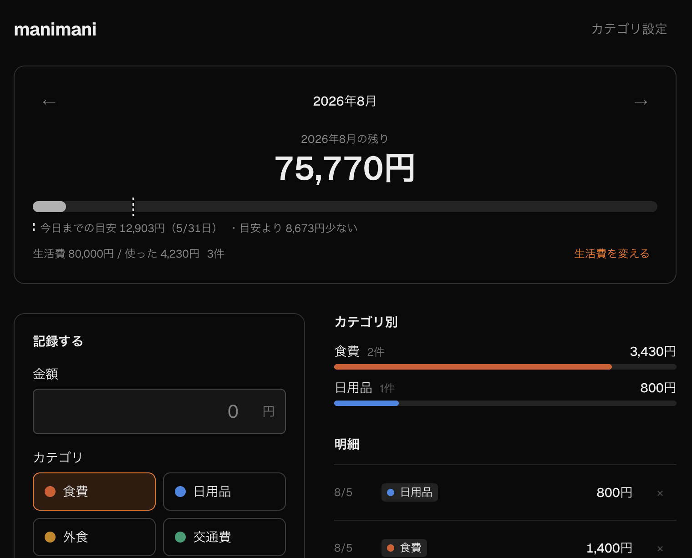

# manimani

生活費集計アプリ



## Tech stack

- [Next.js](https://nextjs.org) (App Router, Turbopack)
- TypeScript
- Tailwind CSS
- ESLint
- [Drizzle ORM](https://orm.drizzle.team) + [libSQL / Turso](https://turso.tech)

## Getting Started

```bash
npm install
npm run db:migrate   # スキーマを DB に適用
npm run db:seed      # 初期カテゴリを投入
npm run dev
```

Open [http://localhost:3000](http://localhost:3000) in your browser.

環境変数は無くても動く。その場合ローカルの `manimani.db` を使い、ログインは素通しになる。
設定できる値は [.env.example](.env.example) を参照。

## デプロイ

### 1. Turso にデータベースを作る

```bash
curl -sSfL https://get.tur.so/install.sh | bash
turso auth login
turso db create manimani

turso db show manimani --url        # → TURSO_DATABASE_URL
turso db tokens create manimani     # → TURSO_AUTH_TOKEN
```

`brew install tursodatabase/tap/turso` は使わない。この formula は
ローカル開発用サーバー sqld（`libsql/sqld` tap）に依存していて、
tap を足していないと `No available formula with the name "libsql/sqld/sqld"` で失敗する。
クラウドに DB を作るだけなら sqld は不要なので、上のスクリプトで入れる方が簡単。

### 2. Turso にスキーマと初期カテゴリを流す

```bash
export TURSO_DATABASE_URL='libsql://...'
export TURSO_AUTH_TOKEN='...'
npm run db:migrate
npm run db:seed
```

### 3. Vercel にデプロイ

GitHub に push して Vercel にインポートし、環境変数を4つ設定する。

| 変数 | 値 |
| --- | --- |
| `TURSO_DATABASE_URL` | 手順1で取得した URL |
| `TURSO_AUTH_TOKEN` | 手順1で取得したトークン |
| `APP_PASSWORD` | ログインに使うパスワード |
| `APP_SECRET` | `openssl rand -hex 32` で生成した文字列 |

`APP_PASSWORD` と `APP_SECRET` が揃っていないと、本番では 500 を返して全ての通信を止める
（設定漏れで誰でも読み書きできる状態にしないため）。`TURSO_DATABASE_URL` も本番では必須。

ローカルの記録を移したい場合、件数が少なければ画面から入れ直すのが早い。
まとまった量があるなら `turso db shell manimani < dump.sql` で流し込む。

### 4. 自動デプロイ

Vercel プロジェクトは `machi-48/manimani` に接続済み。

- `main` に push → **本番**へ自動デプロイ
- 他のブランチ・PR に push → **プレビュー**URLへ自動デプロイ

`vercel.json` でビルドコマンドを `npm test && npm run build` にしてあるので、
**テストが1つでも落ちるとデプロイされず、本番は直前の状態のまま残る。**

手動で出したいときは `npx vercel --prod`。ただしこれは git ではなく
手元のフォルダをそのまま送るので、未コミットの変更も本番に出る点に注意。

**スキーマを変えたときは、push する前に Turso へマイグレーションを流すこと。**
Vercel は自動では流さないので、順番を逆にすると新しいコードが存在しない列を読んで本番が落ちる。

```bash
export TURSO_DATABASE_URL='libsql://...' TURSO_AUTH_TOKEN='...'
npm run db:migrate
git push
```

## Scripts

| command | description |
| --- | --- |
| `npm run dev` | start the dev server |
| `npm run build` | production build |
| `npm run start` | serve the production build |
| `npm run lint` | run ESLint |
| `npm test` | テストを一度実行 |
| `npm run test:watch` | テストを監視実行 |
| `npm run db:generate` | スキーマ変更からマイグレーション SQL を生成 |
| `npm run db:migrate` | 未適用のマイグレーションを DB に適用 |
| `npm run db:seed` | 初期カテゴリを投入（再実行しても重複しない） |
| `npm run db:studio` | Drizzle Studio で DB を GUI から確認 |

## テスト

Vitest。`tests/` 以下にある。

DB を触るテストは**モックせず、一時ファイルの SQLite に本物のマイグレーションを流して**検証する
（`tests/setup.ts` が `TURSO_DATABASE_URL` を使い捨ての一時ファイルに差し替える）。
集計は SQL そのものが実装の本体なので、モックすると何も検証できないため。
本物の `manimani.db` には触らない。

Server Action のテストでは `next/cache` の `revalidatePath` だけ差し替える。
リクエストの文脈が無いと動かないためで、検証対象は入力の受け付け方と DB に入る内容。

## スマホ（PWA）

`src/app/manifest.ts` と `layout.tsx` の `viewport` / `appleWebApp` で、ホーム画面に追加すると
ブラウザUIなしのアプリとして開く。
